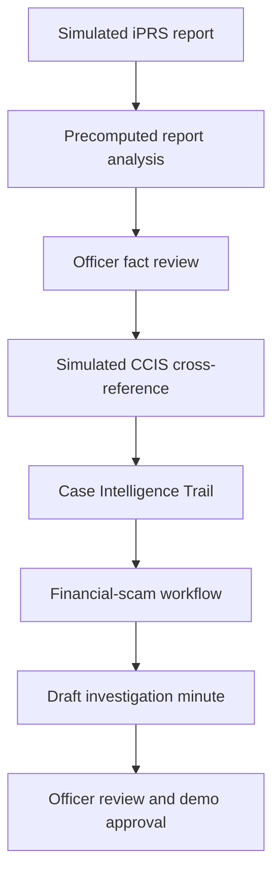
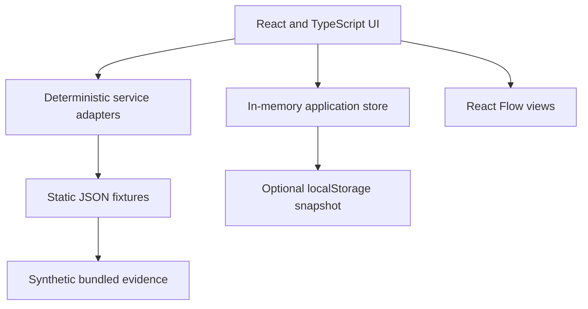

# JSJK Nexus

## Solution Design Specification v1.3

### Mock Capability Demonstration Profile

**Document version:** 1.3  
**Date:** 12 August 2026  
**Supersedes for prototype implementation:** v1.2  
**Retains:** v1.2 as the production-shaped POC and target-architecture reference  
**Intended audience:** AI coding agent, frontend developer, solution architect, demo operator, JSJK leadership, investigators and analysts  
**Prototype audience:** Mixed executive and operational audience  
**Showcase duration:** 10 to 15 minutes, target guided flow 12 minutes  
**Data classification:** Public contextual information and fully synthetic case data only  
**Status:** Build-ready specification  

> **Implementation decision:** Build a standalone React and TypeScript capability demonstration. Use static fixtures, deterministic service adapters and browser state. Do not build Laravel, PostgreSQL, pgvector, Redis, queues, object storage, live OCR, live AI or live iPRS and CCIS connections for this version.
>
> **Product decision:** Preserve the v1.2 report-to-minute workflow. The demonstration begins with a simulated iPRS report, requires officer review of extracted facts, enriches the case with simulated CCIS intelligence, visualises Activity, Relationship and Money trails, supports an illustrative financial-scam workflow and prepares an evidence-linked draft Minit Kertas Siasatan.
>
> **Claim boundary:** v1.3 demonstrates intended workflow and user experience. It does not prove production integration, AI or OCR accuracy, security accreditation, persistence, scalability, concurrency or operational performance.

---

## 1. Purpose and source-of-truth rules

### 1.1 Purpose

This SDS is the implementation contract for the first JSJK Nexus showcase. It removes infrastructure that contributes little to a 10 to 15-minute demonstration while preserving every capability the audience needs to see and evaluate.

The coding agent must be able to build the complete prototype without deciding product scope, inventing data, choosing a backend, calling an external model or interpreting unavailable iPRS or CCIS interfaces.

### 1.2 Source-of-truth precedence

Use this order when instructions conflict:

1. The user's latest explicit instruction.
2. `AGENT.md`.
3. This SDS v1.3 for the mock capability demonstration.
4. SDS v1.2 for product detail not changed by v1.3 and for the future POC architecture.
5. `PROGRESS.md` and approved project decisions.
6. `CHANGELOGS.md`.
7. Existing implementation details.

v1.3 overrides v1.2 wherever v1.2 requires Laravel, Docker Compose, PostgreSQL, pgvector, Redis, object storage, server-side queues, durable database records, server APIs, live AI or live OCR.

v1.3 does not override v1.2's product workflow, synthetic-data rules, evidence traceability, human-review controls, iPRS and CCIS roles, graph semantics, responsible-AI limits or Minit Kertas Siasatan qualification.

### 1.3 Authoritative project inputs

This specification is grounded in:

- `Presentation scope.pdf`, which defines three AI JSJK functions: police-report and case-fact reading, draft Minit Kertas Siasatan preparation and a financial-scam-specific investigation workflow. It also requires an integration approach and an infrastructure and security proposal assessable across security, technical, cost, performance and operational suitability.
- `Presentation Note.docx`, which proposes iPRS as the police-report source and CCIS as the commercial-crime investigation and intelligence reference source. Its unvalidated speed, integration, compliance and operational claims must not be presented as measured facts.
- `Data AI Platform.pdf`, which provides a conceptual on-premise source, use-case, processing and storage architecture. It is a target-architecture reference, not the v1.3 runtime.
- SDS v1.2, which established the report-to-minute product flow, fixture scenario, safeguards and Case Intelligence Trail.

---

## 2. Executive summary

JSJK Nexus is an AI-assisted investigation workspace capability demonstration for Jabatan Siasatan Jenayah Komersil (JSJK), Polis Diraja Malaysia.

The demonstration follows one synthetic investment-scam case from a simulated iPRS report to an editable draft Minit Kertas Siasatan. The system presents precomputed OCR and AI outputs, lets an officer confirm, correct, reject or flag extracted facts, then simulates a separate CCIS cross-reference. A React Flow workspace reveals the activity chronology, relationships across reports and cases, and an illustrative money trail. Verified facts flow into factual minute sections. Unverified indicators, contradictions and evidence gaps remain separate.

The prototype runs entirely in the browser. Static JSON fixtures represent iPRS payloads, CCIS results, evidence, AI analysis, graph layouts, workflow state, audit events and minute drafts. React state provides session behaviour. `localStorage` may preserve the demo across refreshes but is not a durable or secure record. A reset action restores the canonical opening state.

The showcase should make two points clear:

1. AI can reduce repetitive reading, structuring and drafting work while keeping an investigator in control.
2. The path to production requires real interface discovery, approved templates, security design, measured model performance and a PDRM-controlled on-premise architecture.

### 2.1 Desired audience takeaway

By the end of the showcase, the audience should understand that the proposed solution could:

1. Turn an iPRS police report into structured and reviewable facts.
2. Make AI errors visible and correctable before those facts are used elsewhere.
3. Cross-reference reviewed identifiers and tactics against CCIS records.
4. Show what happened, what is connected and where supplied records indicate money moved.
5. Preserve source-system and evidence provenance for every material item.
6. Support an investigator-specific financial-scam workflow.
7. Prepare an editable and cited draft Minit Kertas Siasatan.
8. Reduce duplicate entry and administrative burden if validated in a controlled POC.

### 2.2 Success statement

The prototype is successful when a first-time observer can follow one synthetic report through fact review, CCIS enrichment, visual case intelligence and cited minute drafting within 12 minutes, while an investigator can challenge any material claim and reach its source within two interactions.

---

## 3. Product vision and design principles

### 3.1 Product vision

> Accelerate the journey from an iPRS police report to verified case facts, CCIS-enriched financial-scam intelligence and an evidence-linked draft Minit Kertas Siasatan.

### 3.2 Design principles

1. **Evidence before inference.** Every factual claim links to a source artifact and locator. Inferences are labelled.
2. **Human decision authority.** The system proposes and drafts. It does not determine guilt, approve its own output or trigger enforcement.
3. **Deterministic presentation.** Formal-demo results are precomputed and repeatable.
4. **Credible imperfection.** The fixture includes one plausible incorrect extraction and one ambiguous item so the review control is visible.
5. **Separate exact and analytical links.** Identifier equality is distinct from semantic similarity.
6. **Provenance by default.** Every fact, event, graph element and minute paragraph retains its source system, record ID, artifact and review state.
7. **Synthetic by construction.** No real victim, subject, police, financial or intelligence data is used.
8. **No infrastructure theatre.** The prototype does not run unused production services merely to appear production-ready.
9. **Architecture honesty.** The UI distinguishes the standalone demo runtime from the proposed PDRM-controlled target state.
10. **Official-system authority.** iPRS and CCIS remain authoritative for their own records. The demo does not write back.
11. **Template honesty.** The minute format is illustrative until JSJK supplies and approves the real template.
12. **Operational separation.** Case activities and relationships remain separate from the system audit trail.
13. **Accessible evidence.** Graph content has a tabular alternative and key actions are keyboard operable.
14. **Presentation resilience.** The demo has reset, jump and preloaded states and requires no network.

---

## 4. Scope and implementation profile

### 4.1 In scope for v1.3

- Single-user desktop web demonstration at 1440 x 900 or above.
- React with strict TypeScript.
- Vite unless an existing React repository already uses a compatible build tool.
- `@xyflow/react` for the Case Intelligence Trail.
- Static JSON and bundled synthetic evidence assets.
- Deterministic simulated iPRS, CCIS, OCR and AI adapters.
- In-memory application state with optional `localStorage` persistence.
- One primary synthetic investment-scam case and three historical synthetic CCIS cases.
- Investigation Queue.
- AI Report Reader and Fact Validation.
- Case Intelligence Trail with Activity, Relationship and Money modes.
- Financial-Scam Investigation Workflow.
- Editable and versioned illustrative Minit Kertas Siasatan.
- Browser-side simulated audit trail.
- Integration, target architecture, security and limitations view.
- Guided presentation mode and canonical reset.
- Bahasa Melayu primary labels with English support where practical.
- Pre-generated PDF and DOCX minute files, or browser-side export only if it is reliable and validated.

### 4.2 Explicitly excluded from the v1.3 runtime

- Laravel or another backend.
- Docker Compose as a runtime requirement.
- PostgreSQL, pgvector or another database.
- Redis, background workers or job queues.
- MinIO, S3 or other object storage.
- Server APIs.
- User authentication, real RBAC or multi-user sessions.
- Real OCR, model inference, embeddings or vector search.
- Real iPRS, CCIS, NSRC, banking, telco or National Fraud Portal integration.
- Durable audit, chain-of-custody, evidence storage or approval records.
- Server-generated DOCX or PDF if a pre-generated validated file is sufficient.
- Real file upload as a P0 feature.
- Production performance, scale, availability or security claims.

### 4.3 Future POC profile retained from v1.2

The presentation may show a proposed future POC architecture containing:

- PDRM-controlled on-premise deployment.
- Confirmed iPRS and CCIS integration boundaries.
- Application and AI orchestration services.
- Durable relational storage and document repository.
- Approved semantic retrieval or knowledge-base capability.
- Audit, identity, access control, encryption, monitoring, backup and recovery.
- Model, prompt, embedding and template version tracking.

These are proposal elements. They are not implemented or validated by v1.3.

### 4.4 Capability and claim matrix

| Capability shown | v1.3 mechanism | What can be claimed | What cannot be claimed |
|---|---|---|---|
| iPRS intake | Static payload through mock adapter | Intended intake workflow and provenance | API availability, latency or synchronization |
| OCR | Precomputed text blocks and page regions | Intended review experience | OCR accuracy or document coverage |
| AI extraction | Deterministic result fixture | Intended extraction and validation workflow | Model accuracy, recall or processing speed |
| CCIS enrichment | Precomputed records and links | Intended cross-reference experience | Live CCIS access or match effectiveness |
| Similarity | Precomputed score and excerpts | Explainable retrieval indicator | Common authorship, identity or calibrated probability |
| Money Trail | Supplied synthetic transactions | Visual reconstruction from provided records | Live bank tracing or account status |
| Minute drafting | Template engine and fixture text | Intended cited drafting workflow | Official format, legal sufficiency or measured time saving |
| Audit | Browser event log | Intended events and user experience | Durability, immutability or evidentiary status |
| Security architecture | Proposed target view | Design intent and POC questions | Accreditation, compliance or implemented controls |

---

## 5. Users and jobs to be done

### 5.1 Primary users

#### JSJK senior leader

Needs to understand operational value, integration fit, cost implications, limitations and the path from demo to controlled POC.

#### Investigating Officer

Needs to read a report, verify extracted facts, inspect evidence, understand relationships, manage investigation gaps and prepare a defensible draft minute.

#### Intelligence analyst

Needs to examine shared identifiers, related cases, tactics and financial relationships across iPRS and CCIS-derived information.

#### Supervising officer

Needs to review minute versions, verify citations and approve or return a draft through an illustrative workflow.

#### Demo operator

Needs a reliable 12-minute script, known states, jump controls, reset behaviour and no dependency on external services.

### 5.2 Jobs to be done

- When an iPRS report arrives, structure its material facts and show missing information.
- When AI extracts a fact, let the officer confirm, correct, reject or flag it.
- When initial facts are reviewed, cross-reference CCIS without hiding the source boundary.
- When a possible link appears, show the source record, evidence, match method and verification state.
- When understanding the case, switch between chronology, relationships and supplied financial flow.
- When progressing the investigation, show completed work, gaps and proposed verification actions.
- When preparing a minute, use only verified information in factual sections and cite the evidence.
- When reviewing a minute, preserve edits, versions, comments and status changes for the demo session.

---

## 6. Demonstration scenario and fixture truth

### 6.1 Primary scenario: Operation Sinar Emas

All names, identifiers and events are fictional.

| Field | Fixture value |
|---|---|
| Case ID | `JSJK-DEMO-2026-0471` |
| Simulated iPRS report ID | `IPRS-DEMO-2026-008721` |
| Scam type | Non-existent investment scam |
| Victim alias | Nur Aina Rahman |
| Reported adviser alias | Daniel Lim |
| Group administrator alias | Mei Support |
| Reported loss | RM82,500 |
| Campaign | Quantum Crest Capital |
| Primary phone | `010-000-7712` |
| Secondary phone | `010-000-4839` |
| Campaign domain | `quantum-crest.example` |
| Tracking reference | `ref=QC7712` |
| Initial channel | Social advertisement followed by WhatsApp |

The victim sees an advertisement for an alleged AI-assisted investment platform, joins a WhatsApp group, observes fabricated profit testimonials and communicates with an adviser alias. Five payments are made to three synthetic beneficiary accounts. A withdrawal request leads to a demand for an additional fee, after which the victim files a report represented as an iPRS record.

### 6.2 Required evidence pack

1. Synthetic scanned police-report representation.
2. Precomputed OCR blocks mapped to report pages or regions.
3. Code-switched Bahasa Melayu and English WhatsApp transcript.
4. Transaction CSV or JSON.
5. Synthetic investment-promotion image.
6. Timestamped call transcript.
7. Officer-entered intake chronology.
8. Three historical synthetic CCIS case summaries.
9. Precomputed analysis, graph, similarity and minute fixtures.

### 6.3 Required victim transactions

| ID | Date and time | Destination | Amount |
|---|---|---|---:|
| TX-0471-01 | 2026-07-18 10:14 | `DEMO-MY-24018` | RM10,000 |
| TX-0471-02 | 2026-07-19 14:06 | `DEMO-MY-24018` | RM15,000 |
| TX-0471-03 | 2026-07-22 09:41 | `DEMO-MY-77105` | RM20,000 |
| TX-0471-04 | 2026-07-25 16:22 | `DEMO-MY-55431` | RM25,000 |
| TX-0471-05 | 2026-07-27 11:09 | `DEMO-MY-55431` | RM12,500 |

Total reported victim transfers: RM82,500.

The downstream fixture must account for RM79,000 and explicitly mark RM3,500 as unresolved. The system must not invent a destination for the unresolved amount.

### 6.4 Required historical CCIS records

- `CCIS-DEMO-IP-2026-0318`: related phone identifier or tactic.
- `CCIS-DEMO-IP-2026-0386`: related account or domain indicator.
- `CCIS-DEMO-IP-2026-0442`: related investment-campaign script and shared `ref=QC7712` tracking reference.

At least three exact identifier links and one analytical similarity link must be available after CCIS enrichment.

### 6.5 Required imperfection

The fixture must contain:

- One plausible incorrect extraction marked `demoSeededError: true`.
- One genuinely ambiguous low-confidence item suitable for `Needs verification`.
- Two evidence gaps.
- One contradiction or unresolved discrepancy.

The guided flow must reject the incorrect extraction and flag the ambiguous item. A perfect AI output is a failed demonstration because it hides the role of human review.

---

## 7. End-to-end workflow



### 7.1 Journey states

1. **Queue:** The featured report appears as newly received from simulated iPRS.
2. **Analysis:** A staged 3 to 5-second animation loads deterministic OCR, classification, facts, entities, chronology and missing information.
3. **Review:** The officer confirms, corrects, rejects or flags facts.
4. **Gate:** CCIS cross-reference enables after the required review states are complete.
5. **Enrichment:** A separate deterministic CCIS adapter reveals related records and link rationale.
6. **Case intelligence:** Activity, Relationship and Money views become available with evidence inspection.
7. **Workflow:** The officer reviews investigative status, evidence gaps and next verification actions.
8. **Minute:** The system assembles a cited illustrative draft from current reviewed state.
9. **Review:** The officer edits, comments, regenerates a section, compares versions and changes status.
10. **Close:** The operator shows simulated integrations, target architecture, limitations and system audit.

### 7.2 Review gate

The `Cross-reference with CCIS` action remains disabled until:

- The primary beneficiary account is confirmed or corrected.
- The reported loss total is confirmed.
- The seeded incorrect extraction is rejected or corrected.
- The ambiguous item is marked for verification.
- At least one phone or domain fact is reviewed.

The UI must explain which gate condition remains incomplete.

---

## 8. Information architecture and screens

### 8.1 Global shell

Required elements:

- Product name: **JSJK Nexus**.
- Descriptor: **AI-Assisted JSJK Investigation Workspace**.
- Persistent badge: **SYNTHETIC DEMO DATA**.
- Persistent capability notice: **Simulated iPRS, CCIS and AI services**.
- Navigation: Queue, Report Review, Case Intelligence, Workflow, Investigation Minute, Audit and Architecture.
- Presentation Mode.
- Reset Demo with confirmation.
- Language control for Bahasa Melayu and English where implemented.
- Source badges: `iPRS`, `CCIS`, `AI Extracted`, `Officer Entered`, `Officer Verified`.

Do not use a PDRM crest unless authorised artwork is supplied. Use a neutral shield-style icon.

### 8.2 S01: Investigation Queue

**Purpose:** Establish the problem and entry point within 60 seconds.

Required content:

- Featured iPRS report and JSJK case IDs.
- Received date and location.
- Suspected scam category.
- Reported loss.
- Assigned Investigating Officer.
- Processing and review status.
- `Simulated iPRS Integration` label.
- Four compact summary metrics: new reports, pending fact review, minutes awaiting review and related-case indicators.
- One-line outcome: `From police report to evidence-linked draft investigation minute`.

Interactions:

- Open the featured report.
- Start Presentation Mode.
- Inspect a connector tooltip that states no live PDRM data is used.

### 8.3 S02: AI Report Reader and Fact Validation

**Purpose:** Demonstrate automatic report reading and officer control.

Layout:

- Left: evidence list and artifact metadata.
- Centre: scanned-report, text, chat, transaction or image viewer.
- Right: extracted facts, classification, chronology, modus operandi, contradictions and missing-information prompts.

Required actions:

- `Analyse Report`.
- Confirm fact.
- Correct fact with reason.
- Reject fact with reason.
- Mark for verification.
- Add officer note.
- Open source highlight.
- `Cross-reference with CCIS`, gated until review conditions pass.

Every fact card must show:

- Display value and type.
- Confidence label.
- Review state.
- Source system and record ID.
- Artifact and locator.
- Short excerpt.
- Original value when corrected.

Required notice:

> Precomputed AI and OCR output for demonstration. Results do not represent measured model or OCR accuracy.

### 8.4 S03: Case Intelligence Trail

**Purpose:** Visualise the evidence-backed chronology, relationships and supplied financial flow.

Layout:

- Top: case ID, report ID, scam type, reported loss and workflow status.
- Left: mode selector, filters and legend.
- Centre: React Flow canvas.
- Right: evidence and provenance inspector.
- Bottom: `Add verified facts to investigation minute`.

#### Activity Trail

Answers: `What happened, and in what order?`

Show at least eight events:

1. Advertisement viewed.
2. Initial WhatsApp contact.
3. Group joined.
4. First payment.
5. Subsequent payments.
6. Withdrawal request.
7. Additional fee demand.
8. iPRS report created.

Selecting an event opens the supporting report line, message, transaction or transcript excerpt.

#### Relationship Map

Answers: `Who or what is connected?`

Initial state shows reviewed iPRS facts only. After CCIS enrichment, reveal related cases, accounts, phones, aliases, domains, evidence and modus-operandi indicators.

Use progressive disclosure:

1. Show analytical similarity and matched excerpts.
2. Then reveal exact identifier corroboration.
3. Keep unverified edges dashed and labelled.

#### Money Trail

Answers: `Where did the money go in the supplied records?`

Show victim-to-beneficiary transfers, downstream movements, evidence status and RM3,500 unresolved.

Required notice:

> Illustrative reconstruction from supplied synthetic records. Not connected to bank, NSRC or National Fraud Portal data.

#### Node types

- Police Report.
- CCIS Case.
- Person or Alias.
- Phone.
- Bank Account.
- Transaction.
- Evidence.
- Organisation.
- URL or Domain.
- Modus Operandi.
- Activity Event.

#### Edge types

- `MENTIONED_IN`.
- `USES`.
- `CONTACTED_VIA`.
- `TRANSFERRED_TO`.
- `SUPPORTED_BY`.
- `RELATED_CASE`.
- `EXACT_MATCH`.
- `SIMILAR_MO`.
- `REQUIRES_VERIFICATION`.

#### Visual semantics

- Solid line: directly supported relationship.
- Dashed line: analytical or unverified relationship.
- Directional amount edge: transaction.
- Green marker: officer verified.
- Amber marker: AI extracted or needs verification.
- Grey marker: insufficient information.
- Red: contradiction or evidence gap only, never a person.
- Text label or icon accompanies every colour state.

Every material node and edge must expose source system, source record ID, artifact or record locator, excerpt, match method, review state and rationale.

The same material graph data must be available in a table.

### 8.5 S04: Financial-Scam Investigation Workflow

**Purpose:** Show adaptation to an investigation process rather than a generic document tool.

Required stages:

1. Report received.
2. Facts reviewed.
3. CCIS cross-reference.
4. Financial trail reviewed.
5. Evidence requests.
6. Investigation actions.
7. Minute drafted.
8. Supervisor review.

Stage states:

- Not started.
- In progress.
- Awaiting information.
- Completed.
- Returned.

Required evidence gaps include synthetic examples of bank confirmation, subscriber information, full transaction statement and ownership verification.

Proposed next actions must be labelled `Requires officer decision`. AI processing must never complete an investigation stage automatically.

Required notice:

> Illustrative workflow, subject to validation against JSJK procedures and approval roles.

### 8.6 S05: Minit Kertas Siasatan

**Purpose:** Demonstrate rapid, editable and evidence-grounded drafting.

Required sections:

1. Case reference and metadata.
2. Summary of police report.
3. Material facts verified by the officer.
4. Chronology.
5. Parties and entities involved.
6. Financial transactions.
7. Evidence received.
8. Investigation conducted.
9. Related CCIS records and analytical indicators.
10. Outstanding information and contradictions.
11. Proposed next actions for officer consideration.
12. Officer notes and review status.
13. Source index.

Required notice:

> Illustrative Minit Kertas Siasatan format, subject to validation by JSJK.

Required interactions:

- Generate complete draft.
- Edit one or more sections.
- Regenerate a single section.
- Add and resolve comments.
- Compare versions.
- Open citations.
- Change status among Draft, Under review, Returned for amendment, Ready for approval and Approved for demo.
- Download validated pre-generated PDF and DOCX outputs, or generate them in-browser if tests prove reliability.

Generation rules:

- Confirmed or corrected facts may appear in factual sections.
- Needs-verification items may appear only under `Petunjuk untuk Pengesahan` or the approved equivalent.
- Rejected facts must not appear in active generated content.
- A fact change after generation marks affected sections stale.
- Section regeneration cannot change another section.
- Approval is a user action.

### 8.7 S06: Integration, Target Architecture and Audit

**Purpose:** Answer scope requirements without overstating v1.3.

#### Integration panel

- iPRS: proposed source of police-report metadata, narrative and attachments.
- CCIS: proposed source of commercial-crime case records and intelligence.
- Both connectors are simulated and read-only in v1.3.
- Batch and near-real-time are design options, not confirmed capabilities.
- Write-back is disabled and labelled `Subject to JSJK confirmation`.

#### Target architecture panel

- PDRM-controlled on-premise boundary.
- Secure integration gateway.
- Application and AI use-case layer.
- AI processing and document-intelligence services.
- Structured data, document repository and knowledge-base layer.
- Identity, RBAC, audit, encryption, monitoring, retention, backup and recovery.
- Human approval points.
- No required public-cloud transfer in the proposed target design.

Required runtime notice:

> This prototype runs as a standalone React demonstration. The architecture shown is a proposed target design, not the prototype runtime.

#### System audit panel

Show browser-session events for import, analysis, fact review, CCIS enrichment, graph inspection, minute generation, edit, regeneration, status change, export and reset.

Label the audit clearly:

> Simulated audit trail for workflow demonstration. It is not durable, immutable or evidentiary.

### 8.8 S07: Presentation Mode

Required features:

- Seven numbered steps.
- Time allocation per step.
- Next, Back and Jump controls.
- Keyboard shortcuts.
- Presenter prompt.
- Progress bar.
- Skip animation action.
- Canonical state setup for Report Review, CCIS Reveal, Money Trail and Draft Minute.
- Reset with confirmation.

---

## 9. Prototype architecture

### 9.1 Runtime architecture



### 9.2 Technology choices

- React with strict TypeScript.
- Vite.
- `@xyflow/react`.
- React Router or a minimal router selected by the repository.
- Zod for fixture and boundary validation.
- Zustand or reducer and context for application state. Choose the smaller option unless state complexity justifies Zustand.
- Tailwind CSS plus CSS variables, or an established repository styling system.
- Lucide React or an equivalent consistent icon set.
- Vitest.
- React Testing Library.
- Playwright.
- ESLint and Prettier.
- Optional browser export library only if it does not weaken reliability or bundle safety.

### 9.3 Prohibited runtime dependencies

The coding agent must not add these without a new explicit user decision:

- Backend framework or server API.
- Database.
- Redis or queue.
- Docker requirement.
- AI SDK or model-provider dependency.
- OCR engine.
- Vector database or embedding service.
- Authentication provider.
- Remote analytics or telemetry.
- Remote fonts or assets required at runtime.

### 9.4 Service interfaces

UI components must depend on interfaces, not import raw fixtures directly.

```ts
interface IprsAdapter {
  getQueue(): Promise<IprsQueueItem[]>;
  getReport(reportId: string): Promise<IprsReportPayload>;
}

interface AnalysisAdapter {
  analyse(caseId: string): Promise<CaseAnalysisResult>;
}

interface CcisAdapter {
  crossReference(request: CcisCrossReferenceRequest): Promise<CcisEnrichmentResult>;
}

interface GraphAdapter {
  build(caseId: string, view: GraphView, state: CaseReviewState): Promise<GraphPayload>;
}

interface MinuteAdapter {
  generate(input: MinuteGenerationInput): Promise<InvestigationMinute>;
  regenerateSection(input: SectionRegenerationInput): Promise<MinuteSection>;
}

interface ExportAdapter {
  getAvailableExports(minuteId: string): Promise<DemoExport[]>;
}
```

The fixture implementations return promises with short deterministic delays. A later POC can replace them without changing screen components.

### 9.5 State model

Use a single canonical `DemoState` containing:

- Current schema and fixture version.
- Active case and route.
- Analysis state.
- Fact review decisions.
- CCIS enrichment state.
- Graph mode, filters and selection.
- Workflow states.
- Minute versions and comments.
- Presentation step.
- Simulated audit events.
- Language preference.

State rules:

- Hydrate from the canonical fixture on first load.
- Optionally hydrate from `localStorage` only when schema and fixture versions match.
- Validate saved state before use.
- Discard invalid or stale saved state and return to canonical state.
- Reset clears saved state and deep-clones the canonical fixture.
- Do not mutate imported fixture objects.
- Derive graph and minute eligibility from review state, not duplicated booleans.

### 9.6 Persistence qualification

`localStorage` is optional and exists only to support refresh recovery during a showcase. It must not be described as secure, durable or multi-user storage. Sensitive real data must never be entered into the prototype.

### 9.7 Assets and offline operation

- Bundle all fonts or use a system font stack.
- Bundle icons through the application package.
- Store synthetic artifacts under `public/demo-assets` or import them at build time.
- Do not depend on public CDNs.
- Do not fetch remote images, maps, fonts, APIs or model results.
- The production build must run with network access disabled.

---

## 10. Data contracts

All fixture and saved-state payloads must include `schemaVersion`. All case-related records must include `synthetic: true` where applicable.

```ts
type ReviewState = "unreviewed" | "confirmed" | "rejected" | "needs_verification";
type ConfidenceLevel = "high" | "medium" | "low";
type SourceSystem = "IPRS" | "CCIS" | "EVIDENCE" | "AI_DERIVED" | "OFFICER_ENTERED";
type EvidenceStatus = "reported" | "supported" | "confirmed_record" | "inferred";
type GraphView = "activity" | "relationship" | "money";

interface Provenance {
  sourceSystem: SourceSystem;
  sourceRecordId: string;
  sourceRevision?: string;
  artifactId?: string;
  importedAt: string;
  locator?: EvidenceReference["locator"];
  extractionMethod: "fixture_ocr" | "structured_import" | "text_extraction" | "officer_entry" | "precomputed_analysis";
  originalValue?: string;
}

interface EvidenceReference {
  id: string;
  artifactId: string;
  locator: {
    kind: "line" | "message" | "row" | "region" | "page";
    start: number | string;
    end?: number | string;
  };
  excerpt: string;
}

interface CaseFact {
  id: string;
  caseId: string;
  factType: "person_alias" | "phone" | "bank_account" | "url" | "organisation" | "amount" | "date" | "location" | "transaction_reference" | "modus_operandi";
  displayValue: string;
  normalisedValue?: string;
  confidence: ConfidenceLevel;
  confidenceScore: number;
  reviewState: ReviewState;
  evidenceRefIds: string[];
  provenance: Provenance;
  correctedValue?: string;
  reviewedBy?: string;
  reviewedAt?: string;
  reviewNote?: string;
  demoSeededError?: boolean;
}

interface TransactionRecord {
  id: string;
  caseId: string;
  occurredAt: string;
  sourceLabel: string;
  destinationAccountEntityId: string;
  amountMYR: number;
  channel: string;
  reference?: string;
  evidenceRefIds: string[];
  evidenceStatus: EvidenceStatus;
  provenance: Provenance;
  synthetic: true;
}

interface TimelineEvent {
  id: string;
  caseId: string;
  occurredAt: string;
  eventType: "contact" | "instruction" | "transfer" | "claim" | "report" | "investigation";
  title: string;
  description: string;
  evidenceRefIds: string[];
  confidence: ConfidenceLevel;
  reviewState: ReviewState;
  provenance: Provenance;
}

interface RelationshipEdge {
  id: string;
  sourceId: string;
  targetId: string;
  linkType: "MENTIONED_IN" | "USES" | "CONTACTED_VIA" | "TRANSFERRED_TO" | "SUPPORTED_BY" | "RELATED_CASE" | "EXACT_MATCH" | "SIMILAR_MO" | "REQUIRES_VERIFICATION";
  label: string;
  score?: number;
  evidenceRefIds: string[];
  assessment: "fact" | "analytical_indicator";
  rationale: string;
  verificationState: ReviewState;
  provenance: Provenance[];
  visibleIn: GraphView[];
}

interface GraphPayload {
  caseId: string;
  view: GraphView;
  nodes: Array<{
    id: string;
    nodeType: string;
    label: string;
    sourceBadges: SourceSystem[];
    verificationState: ReviewState;
    position: { x: number; y: number };
  }>;
  edges: RelationshipEdge[];
  generatedFromStateHash: string;
}

interface WorkflowStep {
  id: string;
  caseId: string;
  stepType: "report_received" | "facts_reviewed" | "ccis_cross_reference" | "financial_trail_review" | "evidence_requests" | "investigation_actions" | "minute_drafted" | "supervisor_review";
  status: "not_started" | "in_progress" | "awaiting_information" | "completed" | "returned";
  ownerRole: string;
  supportingFactIds: string[];
  completedBy?: string;
  completedAt?: string;
}

type MinuteStatus = "draft" | "under_review" | "returned_for_amendment" | "ready_for_approval" | "approved_for_demo";

interface CitedParagraph {
  id: string;
  text: string;
  evidenceRefIds: string[];
}

interface MinuteSection {
  id: string;
  sectionType: "report_summary" | "material_facts" | "chronology" | "parties_entities" | "financial_transactions" | "evidence_received" | "investigation_conducted" | "related_indicators" | "outstanding_information" | "proposed_actions" | "officer_notes" | "source_index";
  titleBM: string;
  titleEN: string;
  content: CitedParagraph[];
  editedBy?: string;
  editedAt?: string;
  stale: boolean;
  sourceStateHash: string;
}

interface InvestigationMinute {
  id: string;
  caseId: string;
  templateVersion: string;
  version: number;
  status: MinuteStatus;
  generatedAt: string;
  generatedBy: string;
  sections: MinuteSection[];
  comments: MinuteComment[];
  syntheticNotice: string;
  templateNotice: string;
}

interface AuditEvent {
  id: string;
  caseId?: string;
  actorId: string;
  actorRole: string;
  occurredAt: string;
  action: "import" | "analyse" | "review_fact" | "ccis_cross_reference" | "inspect_graph" | "generate_minute" | "regenerate_section" | "edit_minute" | "change_minute_status" | "export" | "reset";
  targetType: string;
  targetId: string;
  outcome: "success" | "failure";
  metadata: Record<string, string | number | boolean | null>;
  simulated: true;
}
```

### 10.1 Fixture validation

Use Zod schemas to validate:

- Every JSON fixture at application startup in development and in tests.
- Any saved state restored from `localStorage`.
- Adapter outputs before they reach components.
- Minute citations before displaying or exporting a draft.

A fixture validation failure must show a developer-readable error screen and must never silently continue with partial data.

### 10.2 Synthetic identifier rules

- Phones match `010-000-XXXX`.
- Bank accounts begin `DEMO-MY-`.
- Domains and emails use `.example`.
- No MyKad-like identifier.
- iPRS records begin `IPRS-DEMO-`.
- CCIS records begin `CCIS-DEMO-`.
- Every fixture case and artifact carries `synthetic: true` and a fixture version.

---

## 11. Deterministic AI and matching behaviour

### 11.1 Analysis sequence

The `AnalysisAdapter` returns precomputed results but simulates these stages:

1. Document received.
2. OCR text prepared.
3. Entities and transactions extracted.
4. Timeline constructed.
5. Scam type and tactics classified.
6. Missing information identified.

Total staged duration is 3 to 5 seconds. A Skip action completes immediately.

### 11.2 Confidence

Confidence means extraction certainty, not truth.

- High: exact structured value or repeated unambiguous text.
- Medium: clear text requiring normalisation or context.
- Low: ambiguous text, partial value or inferred relationship.

Required tooltip:

> Confidence reflects extraction certainty. It is not a determination that the information is true.

### 11.3 Similarity

The fixture may display a composite analytical score:

`linkScore = 0.50 * textSimilarity + 0.25 * sharedTacticScore + 0.15 * temporalProximity + 0.10 * channelMatch`

These weights are illustrative and unvalidated.

Rules:

- Exact identifiers are shown separately.
- Always display matched excerpts and component rationale.
- Label 0.80 and above `Strong analytical similarity`.
- Label 0.60 to 0.79 `Moderate analytical similarity`.
- Hide lower results by default.
- Do not describe the score as probability, authorship or identity.

### 11.4 Derived-state propagation

- Rejected facts disappear from active graphs and factual minute content.
- Corrected facts replace active display values but preserve originals in review history.
- Needs-verification facts remain available as labelled indicators.
- A material fact change marks dependent minute sections stale.
- Earlier minute versions remain unchanged.
- Reset returns all derived state to the canonical fixture.

---

## 12. Fixture and repository structure

```text
jsjk-nexus/
  README.md
  AGENT.md
  PROGRESS.md
  CHANGELOGS.md
  package.json
  vite.config.ts
  tsconfig.json
  eslint.config.js
  playwright.config.ts
  public/
    demo-assets/
      iprs/
        IPRS-DEMO-2026-008721/
          report.pdf
          report-page-1.png
          investment-promo.png
          whatsapp-transcript.txt
          call-transcript.txt
          transactions.csv
      exports/
        illustrative-minute.pdf
        illustrative-minute.docx
  src/
    app/
      App.tsx
      routes.tsx
      providers.tsx
    components/
      shell/
      queue/
      report-reader/
      evidence/
      case-intelligence/
      workflow/
      minute/
      audit/
      architecture/
      presentation/
      shared/
    domain/
      contracts.ts
      schemas.ts
      selectors.ts
      state-machine.ts
    fixtures/
      manifest.json
      opening-state.json
      public-context.json
      iprs/
      ccis/
      analysis/
      graph/
      workflow/
      minutes/
      audit/
    services/
      adapters/
        iprs.fixture.ts
        ccis.fixture.ts
        analysis.fixture.ts
        graph.fixture.ts
        minute.fixture.ts
        export.fixture.ts
      delay.ts
      state-hash.ts
    state/
      demo-store.ts
      reset.ts
      persistence.ts
    styles/
      tokens.css
      globals.css
    tests/
      fixtures/
      unit/
      component/
  e2e/
```

Equivalent structure is acceptable if boundaries remain clear.

### 12.1 Required fixtures

- `opening-state.json`.
- iPRS queue and report payload.
- OCR blocks and evidence references.
- Case analysis result.
- CCIS enrichment result.
- Activity graph.
- Relationship graph before CCIS.
- Relationship graph after CCIS.
- Money graph.
- Workflow state.
- At least two minute versions.
- Opening audit events.
- Manifest containing fixture version, hashes and required identifiers.

### 12.2 Fixture manifest

The manifest must declare:

- Schema version.
- Fixture version.
- Featured case and report IDs.
- Required artifact paths.
- Expected record counts.
- Expected victim-transfer total.
- Expected accounted and unresolved totals.
- Seeded error fact ID.
- Ambiguous fact ID.
- Required historical CCIS IDs.

Tests use the manifest as the canonical fixture integrity source.

---

## 13. Functional requirements

Priority notation:

- P0: required for the first showcase.
- P1: useful if schedule permits.
- P2: future POC.

| ID | Priority | Requirement | Acceptance summary |
|---|---:|---|---|
| FR-001 | P0 | Show persistent synthetic-data and simulated-service notices | Visible on every screen and export |
| FR-002 | P0 | Load the featured iPRS report and three CCIS cases | Works without network or server |
| FR-003 | P0 | Use separate iPRS and CCIS fixture adapters | Components do not import raw integration fixtures |
| FR-004 | P0 | Show source-system provenance | iPRS and CCIS records remain distinguishable |
| FR-005 | P0 | Run staged deterministic report analysis | Completes in 3 to 5 seconds or through Skip |
| FR-006 | P0 | Show precomputed OCR and source regions | Fact selection opens the correct source location |
| FR-007 | P0 | Classify the report and show rationale | Returns non-existent investment scam with qualification |
| FR-008 | P0 | Extract facts, entities, events and transactions | Every item has evidence and provenance |
| FR-009 | P0 | Confirm, correct, reject or flag facts | Review state updates derived UI |
| FR-010 | P0 | Preserve original and corrected values | Review history shows value, actor, time and reason |
| FR-011 | P0 | Seed one incorrect and one ambiguous extraction | Guided flow exercises both |
| FR-012 | P0 | Gate CCIS cross-reference | Disabled action explains unmet review conditions |
| FR-013 | P0 | Run explicit simulated CCIS enrichment | Related records appear only after user action |
| FR-014 | P0 | Show exact identifier links | Phone, account and domain matches remain separate from similarity |
| FR-015 | P0 | Show analytical script or MO similarity | Includes excerpts, rationale and illustrative score |
| FR-016 | P0 | Visualise Activity Trail | At least eight events link to evidence |
| FR-017 | P0 | Visualise Relationship Map | Supports select, pan, zoom, filter and progressive reveal |
| FR-018 | P0 | Visualise Money Trail | Totals reconcile and evidence status is visible |
| FR-019 | P0 | Switch graph modes without losing case context | Filters and selection persist where applicable |
| FR-020 | P0 | Show node and edge provenance | Source, record, locator, method and state are visible |
| FR-021 | P0 | Distinguish evidence and inference | Solid and dashed edges plus text labels |
| FR-022 | P0 | Provide accessible table alternatives | Material graph content is available without canvas interaction |
| FR-023 | P0 | Show RM3,500 unresolved | No destination is invented |
| FR-024 | P0 | Show illustrative financial-scam workflow | Stages, gaps and next actions appear |
| FR-025 | P0 | Keep officer control over workflow completion | AI animation cannot complete investigation stages |
| FR-026 | P0 | Generate a cited draft minute | Material factual paragraphs resolve to evidence |
| FR-027 | P0 | Label the minute as illustrative | Notice appears in editor and exports |
| FR-028 | P0 | Separate facts, indicators, gaps and actions | Distinct minute sections are used |
| FR-029 | P0 | Edit minute sections | A new session version is created |
| FR-030 | P0 | Regenerate one section | Other sections remain unchanged |
| FR-031 | P0 | Compare minute versions | Changed sections and metadata are visible |
| FR-032 | P0 | Record comments and status | Supported within browser state |
| FR-033 | P0 | Mark dependent sections stale | Triggered after reviewed source changes |
| FR-034 | P0 | Offer PDF and DOCX demo exports | Files contain citations and notices |
| FR-035 | P0 | Exclude rejected facts from active minute | Verified by tests |
| FR-036 | P0 | Isolate unverified indicators | They do not appear as established facts |
| FR-037 | P0 | Record significant simulated audit events | Actor, time, action and outcome are shown |
| FR-038 | P0 | Separate system audit from case activity | Separate model, view and labels |
| FR-039 | P0 | Support guided presentation mode | Seven steps, prompts, jumps and reset work |
| FR-040 | P0 | Reset all mutable state | Restores canonical opening state |
| FR-041 | P0 | Validate fixtures and saved state | Invalid state fails safely |
| FR-042 | P0 | Support Bahasa Melayu core labels | Navigation, actions, warnings and minute headings |
| FR-043 | P0 | Show integration and target architecture | iPRS, CCIS and on-premise proposal are visible |
| FR-044 | P0 | Distinguish demo runtime and target state | React-only notice is explicit |
| FR-045 | P0 | Show prototype limitations | Available from every screen through a clear entry point |
| FR-046 | P0 | Operate fully offline | No remote runtime request is required |
| FR-047 | P0 | Recover from refresh where enabled | Valid saved state restores, invalid state resets |
| FR-048 | P0 | Use precomputed graph layouts | Formal flow does not depend on live force layout |
| FR-049 | P0 | Use deterministic processing durations | Timings remain presenter-friendly and skippable |
| FR-050 | P0 | Provide deep links or stable routes | Presentation jumps land on valid prepared states |
| FR-051 | P1 | Accept local text, CSV or JSON for display only | Must be labelled non-analysed unless a fixture exists |
| FR-052 | P1 | Provide full minute content in both languages | References and review states remain identical |
| FR-053 | P1 | Provide executive summary view | Changes depth, not facts |
| FR-054 | P2 | Replace fixture adapters with validated POC services | Requires a new approved implementation profile |
| FR-055 | P2 | Add real authentication, persistence and integration | Requires PDRM architecture and security decisions |

---

## 14. Non-functional requirements

| ID | Area | Requirement |
|---|---|---|
| NFR-001 | Reliability | Complete the formal flow without internet, server or external model |
| NFR-002 | Startup | Warm production build becomes interactive within 3 seconds on the target laptop |
| NFR-003 | Analysis timing | Staged report analysis completes within 5 seconds |
| NFR-004 | Enrichment timing | CCIS reveal completes within 3 seconds |
| NFR-005 | Graph performance | Interaction remains responsive at 75 nodes and 150 edges |
| NFR-006 | Minute timing | Deterministic draft generation completes within 3 seconds |
| NFR-007 | Determinism | Reset produces identical fixture counts, IDs, totals and hashes |
| NFR-008 | Usability | A new operator can complete the guided flow using prompts |
| NFR-009 | Explainability | Every material claim has evidence or an explicit indicator or gap label |
| NFR-010 | Accessibility | Core flow is keyboard operable and graph data has a table alternative |
| NFR-011 | Privacy | No real person, account, phone, case or intelligence record is included |
| NFR-012 | Security | No secret, API key, remote analytics token or sensitive credential exists in the bundle |
| NFR-013 | Maintainability | Components depend on typed adapters and domain contracts |
| NFR-014 | Portability | Build and preview use documented npm commands |
| NFR-015 | Offline | Fonts, icons, data and artifacts are local |
| NFR-016 | Compatibility | Support current Chromium and Edge desktop browsers |
| NFR-017 | Projection | Critical labels remain legible at 1440 x 900 and 100 percent zoom |
| NFR-018 | Language | Bahasa Melayu characters render correctly in UI and exports |
| NFR-019 | Recovery | Invalid saved state returns to canonical state with a clear notice |
| NFR-020 | Claim safety | No output implies live integration, measured AI accuracy or implemented target security |
| NFR-021 | Export | Demo files open correctly and contain required notices and citations |
| NFR-022 | Build quality | Type checking, lint, tests and production build pass |

---

## 15. UI design system

### 15.1 Direction

Use a restrained investigation-workspace aesthetic. Avoid neon cyber styling, animated world maps, guilt-oriented red nodes and decorative AI-brain imagery.

### 15.2 Tokens

```css
:root {
  --color-navy-950: #081522;
  --color-navy-900: #0f2235;
  --color-blue-700: #195c9b;
  --color-blue-500: #2f80c9;
  --color-cyan-400: #42c5d4;
  --color-amber-500: #d99a2b;
  --color-red-600: #b83b3b;
  --color-green-600: #2f7d57;
  --color-slate-700: #334155;
  --color-slate-500: #64748b;
  --color-slate-200: #e2e8f0;
  --color-slate-100: #f1f5f9;
  --color-white: #ffffff;
  --radius-sm: 6px;
  --radius-md: 10px;
  --radius-lg: 16px;
  --shadow-panel: 0 8px 24px rgba(8, 21, 34, 0.10);
}
```

### 15.3 Typography

- Use Inter, Source Sans 3 or system sans-serif.
- Page title: 28 to 32 px.
- Section title: 18 to 22 px.
- Body: 14 to 16 px.
- Data label: 12 to 13 px.
- Evidence excerpt: 14 px with 1.55 line height.
- Avoid text below 12 px on projected screens.

### 15.4 Accessibility

- Target WCAG 2.1 AA contrast.
- Provide visible focus.
- Make actions keyboard operable.
- Trap focus in dialogs and close with Escape.
- Respect reduced motion.
- Never encode state by colour alone.
- Provide text summaries for charts.
- Provide a table alternative for each graph mode.

---

## 16. Security, privacy and responsible AI

### 16.1 v1.3 controls

- Synthetic and public contextual data only.
- No external telemetry by default.
- No model or API credentials.
- No remote calls at runtime.
- No real identifiers.
- No live uploads in the formal flow.
- Simulated integrations are read-only.
- Reset clears optional saved state.
- Audit events are explicitly simulated and non-durable.

### 16.2 Responsible-use rules

The system may assist with classification, extraction, normalisation, timeline construction, retrieval, similarity explanation, missing-information detection and drafting.

The system must not:

- Determine guilt, identity, intent or criminal risk.
- Recommend arrest, prosecution, surveillance or account freezing.
- Claim two aliases are the same person without corroboration.
- Invent identifiers, transactions, dates, evidence or citations.
- Present similarity as proof of authorship, control or syndicate membership.
- Hide uncertainty, contradiction, rejected output or provenance gaps.
- Mark investigation work complete because an animation finished.
- Approve a minute automatically.

Use language such as `reported`, `appears in supplied records`, `analytical indicator`, `requires verification` and `suggested verification action`.

### 16.3 Required notices

**Global:**

> Synthetic demonstration data. AI output is for investigative support and requires human verification. It is not a finding of fact, identity or guilt.

**AI and OCR:**

> Precomputed AI and OCR output for demonstration. Results do not represent measured model or OCR accuracy.

**Similarity:**

> Similarity indicates shared language or tactics. It does not establish common authorship, control or identity.

**Money Trail:**

> Illustrative reconstruction from supplied synthetic records. Not connected to bank, NSRC or National Fraud Portal data.

**Minute:**

> Illustrative Minit Kertas Siasatan format, subject to validation by JSJK. Draft content requires officer review and approval.

**Integration:**

> Simulated iPRS and CCIS integrations using synthetic data. API availability, permissions, fields, timing and write-back remain subject to confirmation.

**Runtime:**

> This prototype runs as a standalone React demonstration. It does not implement production persistence, security, integration or AI services.

---

## 17. Guided demonstration script

### 17.1 Target duration: 12 minutes

| Step | Time | Operator action | Audience message |
|---|---:|---|---|
| 1. Receive report | 1:00 | Open Queue and select `IPRS-DEMO-2026-008721` | The workflow begins from iPRS, represented here by a simulated connector |
| 2. Read and verify | 2:15 | Run analysis, inspect sources, reject seeded error and flag ambiguity | AI reduces reading effort, but the officer controls accepted facts |
| 3. Activity Trail | 1:30 | Inspect chronology and one evidence source | Fragmented evidence becomes a reviewable sequence |
| 4. CCIS enrichment | 2:00 | Cross-reference, reveal similarity, then exact links | CCIS-derived information adds context without hiding provenance |
| 5. Money Trail | 1:15 | Show accounted and unresolved funds | This reconstructs supplied records, not live bank tracing |
| 6. Draft minute | 2:15 | Generate, cite, edit, regenerate and compare | Verified facts flow into an editable draft while indicators remain separate |
| 7. Architecture and audit | 1:45 | Show simulated integrations, target design, limitations and audit | The demo proves workflow intent; a POC must validate architecture and performance |

### 17.2 Backup plan

- Use the production build, not a development server, for the formal showcase.
- Keep the canonical reset available.
- Provide prepared-state jump links.
- Keep processing animations skippable.
- Bundle a local screen recording as final backup.
- Keep validated PDF and DOCX exports locally available.
- Do not attempt live uploads or live AI during the formal presentation.

---

## 18. Five-dimension POC framing

The v1.3 architecture screen must map the proposal to the five assessment areas without claiming implementation.

| Dimension | What v1.3 demonstrates | What a POC must validate |
|---|---|---|
| Security | Human gates, provenance, target on-premise controls and qualified data flow | Identity, access, encryption, audit, retention, monitoring and accreditation |
| Technical | Modular UI, typed adapters and separate iPRS and CCIS boundaries | Real interfaces, data quality, orchestration, model integration and failure recovery |
| Cost | A low-cost demonstration and phased architecture | Infrastructure, licensing, model, integration, storage and support costs |
| Performance | Repeatable demonstration timings | Real OCR, extraction, retrieval, graph, export, throughput and concurrency targets |
| Operational suitability | Officer review, graph, workflow and minute user experience | Usability, correction rate, adoption, procedure fit and duplicate-entry reduction |

Do not repeat unmeasured claims such as `thousands of pages in real time`, `full compliance`, `seamless integration` or `under two minutes` as facts.

---

## 19. Testing strategy

### 19.1 Unit tests

- Fixture schema validation.
- Saved-state validation and version mismatch reset.
- Phone, account and URL normalisation.
- Evidence-reference resolution.
- Transaction totals and RM3,500 reconciliation.
- Exact-match separation from similarity.
- Similarity label and disclaimer.
- Review gate conditions.
- Rejected fact exclusion.
- Corrected fact propagation.
- Stale minute-section detection.
- Single-section regeneration isolation.
- Minute citation coverage.
- Audit-event creation and qualification.
- Canonical reset deep-clone behaviour.

### 19.2 Component tests

- Queue opens the correct report.
- Analysis stages progress and Skip works.
- Fact selection highlights the correct evidence.
- Confirm, correct, reject and flag actions update states.
- CCIS button explains and enforces the gate.
- CCIS reveal expands the graph only after user action.
- Graph filters update graph and table.
- Provenance drawer shows correct source record and excerpt.
- Minute editor retains manual changes.
- Regeneration changes only the selected section.
- Version comparison identifies changed sections.
- Presentation jumps load valid prepared states.
- Reset restores opening state.

### 19.3 End-to-end tests

#### E2E-01: Full guided flow

1. Start the production preview with network blocked.
2. Open the featured report.
3. Run deterministic analysis.
4. Reject the seeded error.
5. Flag the ambiguous fact.
6. Confirm the beneficiary account and loss.
7. Open Activity Trail and one source.
8. Run CCIS enrichment.
9. Inspect similarity and exact-match provenance.
10. Open Money Trail and confirm RM3,500 unresolved.
11. Open workflow.
12. Generate minute.
13. Open citation, edit one section and regenerate one section.
14. Compare versions and mark Ready for approval.
15. Open architecture, limitations and audit.
16. Download an export.
17. Reset.

Expected: no remote request, no error, all fixture values appear and reset restores the opening state.

#### E2E-02: Rejected extraction

Reject the seeded incorrect fact. Confirm it disappears from active graph and factual minute content but remains in simulated audit history.

#### E2E-03: Fact correction after generation

Correct a fact after a minute exists. Confirm the earlier version remains, dependent sections become stale and a new draft uses the corrected value.

#### E2E-04: Invalid saved state

Seed an incompatible or malformed `localStorage` value. Confirm the application clears it, restores canonical state and displays a brief recovery notice.

#### E2E-05: Accessibility path

Complete fact review, inspect all three graph modes and review the minute using keyboard controls and table alternatives.

#### E2E-06: Offline build

Block network requests. Load the built site, complete the flow, open assets and exports and confirm no missing remote dependency.

### 19.4 Content validation

- All phone numbers match the required pattern.
- All bank accounts use `DEMO-MY-`.
- All domains use `.example`.
- All records are synthetic.
- No MyKad-like pattern appears.
- The WhatsApp transcript contains realistic BM and English code-switching.
- `ref=QC7712` appears verbatim in relevant synthetic evidence.
- At least one seeded error and one ambiguous item exist.
- All victim transfers total RM82,500.
- Accounted value is RM79,000 and unresolved value is RM3,500.
- Every factual minute paragraph resolves to reviewed evidence.
- Unverified links appear only as indicators.
- Required notices appear in screens and exports.
- No output claims live iPRS, CCIS, bank, NSRC or National Fraud Portal access.
- No person is labelled guilty, criminal, mastermind or confirmed syndicate member by AI.

### 19.5 Visual regression targets

- Queue at 1440 x 900.
- Report Reader before and after review.
- Activity Trail.
- Relationship Map before and after CCIS reveal.
- Money Trail.
- Workflow.
- Minute editor and version comparison.
- Architecture, limitations and audit.
- 1024 px tablet width as a secondary target.

---

## 20. Acceptance criteria and definition of done

The v1.3 mock capability demonstration is done when:

1. A clean checkout can install, test, build and preview through documented npm commands.
2. No backend, database, Redis, Docker, external model or remote API is required.
3. The full 12-minute flow works with network access disabled.
4. iPRS and CCIS are separate typed fixture adapters with visible simulated labels.
5. The featured case and three historical CCIS records load from validated fixtures.
6. The report reader shows precomputed OCR, at least 15 facts or entities, five victim transactions and at least eight events.
7. Every material item exposes evidence and provenance.
8. The guided flow rejects one seeded incorrect extraction and flags one ambiguous item.
9. The CCIS gate works and explains unmet conditions.
10. CCIS enrichment reveals related records only after explicit user action.
11. Activity, Relationship and Money modes render through React Flow with precomputed layouts.
12. Each graph mode has a materially equivalent table alternative.
13. Similarity is shown before exact corroboration and is qualified as illustrative.
14. Solid and dashed edges distinguish evidence and inference without colour alone.
15. Money Trail reconciles RM82,500, accounts for RM79,000 and leaves RM3,500 unresolved.
16. The workflow separates system processing from investigator completion.
17. The minute includes all required sections, citations and notices.
18. Rejected facts are absent from factual sections.
19. Needs-verification links appear only as indicators.
20. A user can edit, comment, regenerate one section, compare versions and change status.
21. Source changes mark dependent minute sections stale and preserve earlier versions.
22. The PDF and DOCX demo exports open and contain citations and notices.
23. Simulated audit events appear in a separate audit view and are labelled non-durable.
24. Reset restores canonical counts, IDs, totals and states.
25. Optional refresh recovery rejects incompatible state safely.
26. Synthetic and capability notices remain visible throughout the flow.
27. The architecture view clearly distinguishes the React runtime from the proposed on-premise target state.
28. No output claims implemented production security, live integration, model accuracy or operational performance.
29. Type check, lint, unit, component, end-to-end and production build checks pass.
30. `README.md`, `AGENT.md`, `PROGRESS.md` and `CHANGELOGS.md` match the implementation state.

---

## 21. Implementation plan for the coding agent

### Phase 0: Establish the frontend

1. Inspect `AGENT.md`, `PROGRESS.md`, `CHANGELOGS.md` and this SDS.
2. Create or verify React, Vite and strict TypeScript setup.
3. Add routing, shell, tokens, error boundary and test harness.
4. Add Zod fixture schemas and the manifest.
5. Add canonical store, versioned persistence and reset.

Exit: production build loads the shell and validates the opening fixture.

### Phase 1: Queue and report review

1. Implement iPRS fixture adapter.
2. Implement Queue.
3. Implement evidence viewer.
4. Implement staged analysis adapter.
5. Implement fact review and gate logic.
6. Test seeded error, ambiguity and provenance.

Exit: the report can be analysed, reviewed and made eligible for CCIS enrichment.

### Phase 2: CCIS and Case Intelligence Trail

1. Implement CCIS fixture adapter.
2. Add progressive enrichment.
3. Implement graph contracts and precomputed layouts.
4. Build Activity, Relationship and Money modes.
5. Add provenance inspector, filters, legends and accessible tables.
6. Test totals, link semantics and rejected-fact propagation.

Exit: all three graph modes are reliable and evidence-backed.

### Phase 3: Workflow and minute

1. Build illustrative workflow and evidence gaps.
2. Implement minute template adapter.
3. Add citations, editor, comments, versions, stale state and status transitions.
4. Add validated pre-generated exports or reliable browser export.
5. Test factual, indicator and rejected-item separation.

Exit: complete report-to-minute story works.

### Phase 4: Presentation, architecture and QA

1. Build integration, target architecture, limitations and audit views.
2. Add presentation steps, prompts, jumps and Skip controls.
3. Complete BM labels and accessibility.
4. Add content scans and visual regressions.
5. Run the formal flow at least three times with network blocked.
6. Update documentation and project records.

Exit: Section 20 is satisfied.

---

## 22. Coding-agent execution rules

1. Treat v1.3 as the implementation source of truth for the first showcase.
2. Do not build backend infrastructure unless the user explicitly changes the profile.
3. Read `PROGRESS.md` at session start and update `PROGRESS.md` and `CHANGELOGS.md` before ending any changed session.
4. Implement P0 requirements before P1 or visual extras.
5. Preserve fixture identifiers and totals exactly.
6. Keep UI components behind typed service interfaces.
7. Validate fixtures and restored state.
8. Preserve provenance through review, graph and minute states.
9. Keep fixture output and animations deterministic.
10. Never add a real model, live integration or remote runtime dependency as a shortcut.
11. Never present the illustrative minute as official.
12. Never automate approval or enforcement.
13. Add tests with each capability.
14. Record deviations and unresolved decisions.
15. Run the offline end-to-end flow before declaring completion.

### 22.1 Suggested initial prompt

```text
Build the JSJK Nexus v1.3 Mock Capability Demonstration using AGENT.md and this SDS as the source of truth.
Read PROGRESS.md and CHANGELOGS.md before coding, and update both before ending a changed session.
Use React, strict TypeScript, Vite, static validated fixtures, deterministic typed adapters and browser state.
Use @xyflow/react for Activity, Relationship and Money views with precomputed layouts and accessible tables.
Do not add Laravel, Docker, a database, Redis, queues, live OCR, live AI or real iPRS and CCIS integration.
Implement the report review gate, progressive CCIS reveal, evidence provenance, financial-scam workflow and editable cited minute.
Preserve synthetic identifiers, human control and all safety notices. Complete P0 requirements first.
The final gate is the complete 12-minute production-build demonstration with network access disabled.
```

---

## 23. Risks and mitigations

| Risk | Impact | Mitigation |
|---|---|---|
| Demo is mistaken for production | Credibility loss | Persistent runtime and limitation notices |
| Precomputed output is mistaken for measured AI | False expectation | Label AI and OCR output as precomputed |
| Browser audit is mistaken for durable audit | Governance confusion | Explicit non-durable label and target-state explanation |
| Graph implies guilt | Investigative harm | Neutral node language, provenance and evidence-versus-inference semantics |
| Similarity implies identity | Analytical harm | Excerpts, score qualification and separate exact matches |
| Money Trail implies live tracing | Scope confusion | Supplied-record disclaimer and evidence statuses |
| Minute is mistaken for official format | Procedural risk | Persistent illustrative-template notice |
| Perfect fixtures make review look ceremonial | Low operational trust | Seed realistic incorrect and ambiguous extractions |
| `localStorage` is treated as secure persistence | Security misunderstanding | Optional use only and explicit qualification |
| Browser export is unreliable | Demo failure | Prefer validated pre-generated files |
| Offline assets are missing | Presentation interruption | Bundle and test every dependency |
| Implementation drifts back to v1.2 infrastructure | Delay and wasted effort | v1.3 precedence and prohibited dependency list |
| Future architecture is oversold | Trust loss | Frame every control as proposed and POC-dependent |

---

## 24. Decisions required before a real POC

1. Approved Minit Kertas Siasatan template, section order and mandatory wording.
2. Officer, supervisor and DPP-related review and approval roles.
3. iPRS and CCIS API availability, data dictionaries, authentication and permissions.
4. Batch, near-real-time and write-back constraints.
5. Source-system ownership and synchronization rules.
6. Data classification, retention, deletion, audit and evidentiary requirements.
7. Approved masked reference dataset for OCR and model evaluation.
8. PDRM identity, access, encryption and key-management standards.
9. On-premise capacity, latency, availability, monitoring, backup and disaster-recovery targets.
10. Boundary between JSJK analysis, NSRC coordination and National Fraud Portal functions.
11. Pilot baselines and go or no-go metrics.

---

## Appendix A. Minimum fixture content

- One synthetic scanned police report with 25 to 40 numbered lines.
- OCR blocks mapped to page or region.
- WhatsApp transcript with 35 to 50 timestamped BM and English messages.
- Call transcript with at least 10 timestamped utterances.
- Five victim transactions totalling RM82,500.
- At least three downstream transfers.
- At least 15 extracted facts or entities.
- At least eight Activity Trail events.
- Three exact cross-case links.
- One analytical similarity link with excerpts and component rationale.
- Two evidence gaps.
- One contradiction.
- One seeded incorrect extraction.
- One ambiguous low-confidence item.
- Both campaign URLs containing `ref=QC7712` in the evidence text.
- Four precomputed graph layouts.
- Two minute versions.
- Simulated audit events covering the guided flow.

## Appendix B. Acceptable and unacceptable wording

### Acceptable

- `The account identifier DEMO-MY-24018 appears in three synthetic case records.`
- `The two excerpts show strong analytical similarity and share an urgency tactic.`
- `These links are investigative indicators requiring verification.`
- `The supplied records account for RM79,000 of the reported RM82,500.`
- `The simulated CCIS records require officer verification before operational use.`

### Unacceptable

- `The account holder is the mastermind.`
- `Daniel Lim committed the scam.`
- `The same syndicate operated all four cases.`
- `The AI proved the accounts are connected.`
- `The remaining RM3,500 was laundered.`

## Appendix C. Source list

1. Project source, `Presentation scope.pdf`, item (i)(a) to (c), item (ii) and item (iii).
2. Project source, `Presentation Note.docx`, proposed iPRS, CCIS, on-premise and presentation framing.
3. Project source, `Data AI Platform.pdf`, conceptual on-premise source, use-case, processing and storage layers.
4. `JSJK_Nexus_Solution_Design_Specification_v1.2.md`, prior production-shaped POC specification and product baseline.

---

## Document control

| Item | Value |
|---|---|
| Owner | Prototype sponsor to be assigned |
| Prepared for | AI JSJK capability showcase |
| Intended implementation | Standalone mock capability demonstration |
| Review cycle | Review after stakeholder walkthrough |
| Change control | Update `CHANGELOGS.md`, `PROGRESS.md` and this SDS when scope or profile changes |

## Document history

| Version | Date | Summary |
|---|---|---|
| 1.0 | 12 August 2026 | Initial build-ready specification |
| 1.1 | 12 August 2026 | Strengthened similarity, review imperfection, BM and English evidence and ingestion honesty |
| 1.2 | 12 August 2026 | Rebased the workflow on iPRS intake, CCIS enrichment, three-mode Case Intelligence Trail and Minit Kertas Siasatan using a production-shaped Laravel and Docker architecture |
| 1.3 | 12 August 2026 | Introduced the React-only Mock Capability Demonstration Profile. Replaced backend, database, Redis, queues, live AI and live integration requirements with validated static fixtures, deterministic typed adapters, browser state, offline operation and explicit capability limitations while preserving the v1.2 product workflow and future POC architecture |
